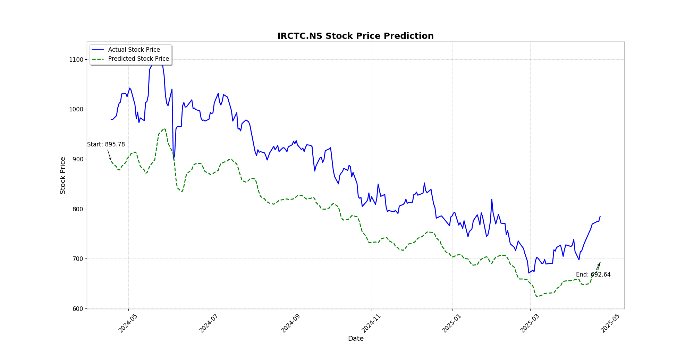

# 📈 Stock Price Prediction Web Application

This project is a web-based application that predicts future stock prices using **Long Short-Term Memory (LSTM)** neural networks. Built with **Python**, **Flask**, and **Keras**, it allows users to enter a stock ticker and date range, trains an LSTM model on historical stock data, and returns a **predicted price, model accuracy**, and a **visual chart** of predicted vs. actual stock prices.

---

## 🚀 Features

- 📊 Fetch historical stock data using yFinance API
- 🧠 Predict stock prices using an LSTM neural network
- 📈 Visualize actual vs predicted prices with Matplotlib
- 💡 Display model prediction accuracy (in %)
- 🌐 User-friendly web interface using HTML, CSS, and JavaScript

---

## 🧰 Tech Stack

- **Frontend**: HTML, CSS, JavaScript
- **Backend**: Flask (Python)
- **Machine Learning**: LSTM (Keras + TensorFlow)
- **Data Source**: [yFinance](https://pypi.org/project/yfinance/)
- **Visualization**: Matplotlib

---

## 🛠️ Installation

### 1. Clone the Repository
```bash
git clone https://github.com/Mayankjaiswal04/Stock-Price-Prediction-using-LSTM
cd stock-price-predictor
```

### 2. Create and Activate Virtual Environment
```bash
python -m venv venv
# Windows
venv\Scripts\activate
# Linux/Mac
source venv/bin/activate
```

### 3. Install Required Packages
```bash
pip install -r requirements.txt
```

### 4. Run the App
```bash
python app.py
```

### 5. Access in Browser
Open your browser and visit:  
[http://127.0.0.1:5000](http://127.0.0.1:5000)

---

## 📂 Project Structure

```
├── app.py                  # Flask app
├── predict.py              # LSTM model and logic
├── templates/
│   └── Index.html          # Frontend page
├── static/
│   ├── styles.css          # CSS styling
│   └── prediction_plot.png # Generated plot
├── README.md
├── requirements.txt
```

---

## 📈 Sample Output

- **Predicted Price**: ₹285.60  
- **Model Accuracy**: 87.23%  
- 

---

## ⚠️ Limitations

- LSTM requires a large amount of clean historical data.
- External factors like news or global events are not considered.
- Performance depends on hyperparameter tuning.

---

## 📌 Future Enhancements

- Integrate real-time news sentiment analysis
- Use GRU/Transformer models for performance boost
- Deploy to cloud (e.g., Heroku, AWS)
- Add support for multiple stocks and portfolio predictions

---

## 📚 References

- [yFinance API](https://pypi.org/project/yfinance/)
- [Keras Documentation](https://keras.io/)
- [Flask Docs](https://flask.palletsprojects.com/)
- [TensorFlow](https://www.tensorflow.org/)
- Hochreiter & Schmidhuber (1997), LSTM Networks

---

## 👨‍💻 Author

**Mayank Jaiswal**  
Roll No: 500120385  
University of Petroleum and Energy Studies  
Minor Project I — Jan-May 2025
